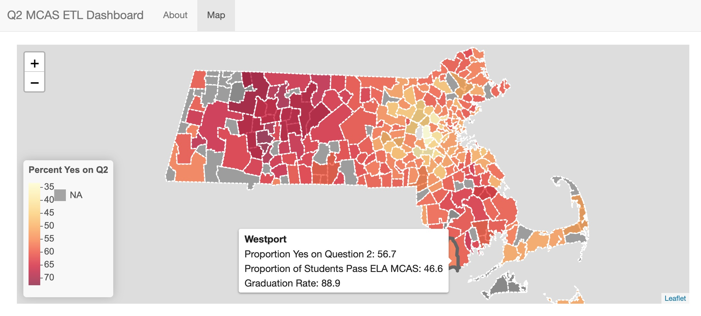

# ETL Pipeline for 2024 Question 2 Polling and School Outcomes in Massachusetts



## Data Extraction Overview
In the 2024 election, Massachusetts Question 2 would repeal the state-wide MCAS high school graduation requirement and allow for districts to set graduation requirements for students. In my data engineering final project, I will pull together voting outcome data along with school district-level MCAS achievement data and graduation rates to create a data set for analysis. I will use Python to scrape the data from public MA Department of Elementary and Secondary Education (DESE) reports as well as from the Secretary of the Commonwealth of MA election statistics website. Finally, I will extract GIS data available from the Mass.gov website to link the town-level election restults with school district outcomes. This GIS data will also provide Shapefile geometries to create an interactive map output.

## Data Sources and Transformation Steps
- [MA DESE School and District Reports](https://profiles.doe.mass.edu/)
    - Two raw tables will be pulled, MCAS achievement and graduation rates
    - For MCAS achievement, raw data is at the district-subject level. Reshape wide to be at the district level.
    - Merge MCAS and graduation rates data at the district level.
    - Convert numeric columns to numeric data type.
- [Secretary of the Commonwealth of MA Election Results](https://electionstats.state.ma.us/ballot_questions/view/11621)
    - Text cleaning of county and town names.
    - Convert numeric columns to numeric data type.
- [MassGIS](https://www.mass.gov/info-details/massgis-data-public-school-districts)
    - Relevant data from Shapefile includes includes district codes, list of member towns for each district, and district Polygon.
    - Pull out district code and list of member towns. Reshape longer to create district-town lookup.
    - Pull out district code and Polygon object. Filter out any invalid geometries.
 
## Database Schema
The data will be loaded into a PostgreSQL database hosted locally. SQL code to create each of the four tables is shown below. 
```
# Define a database model for election results
CREATE TABLE election_result (
    id SERIAL PRIMARY KEY,
    county VARCHAR(100),
    town VARCHAR(100),
    response_yes NUMERIC,
    response_no NUMERIC,
    response_blank NUMERIC,
    response_total NUMERIC
);

# Define a database model for school district outcomes
CREATE TABLE school_district (
    id SERIAL PRIMARY KEY,
    district_code NUMERIC,
    district_name VARCHAR(100),
    year NUMERIC,
    num_meets_exceeds_ela NUMERIC,
    num_partial_meet_ela NUMERIC,
    num_not_meet_ela NUMERIC,
    percent_grad NUMERIC
);

# Define a database model for district-town linking
CREATE TABLE district_town_lookup (
    id SERIAL PRIMARY KEY,
    district_code NUMERIC,
    district_name VARCHAR(100),
    town VARCHAR(100)
);

# Define a database model for GIS data
CREATE TABLE district_shapes (
    id SERIAL PRIMARY KEY,
    district_code NUMERIC,
    district_name VARCHAR(100),
    geometry GEOMETRY(MULTIPOLYGON, 4326)
);
```

## Automation
One of the three ETL pipelines is automated by a locally-hosted, Dockerized Airflow workflow. When running, this pipeline runs on a daily schedule to pull the MassGIS data. The other two pipelines, those that include a web scraping component, can be run manually from the command line.

## Database Schema
The data will be loaded into a PostgreSQL database hosted locally. SQL code to create each of the four tables is shown below. 
```
# Define a database model for election results
CREATE TABLE election_result (
    id SERIAL PRIMARY KEY,
    county VARCHAR(100),
    town VARCHAR(100),
    response_yes NUMERIC,
    response_no NUMERIC,
    response_blank NUMERIC,
    response_total NUMERIC
);

# Define a database model for school district outcomes
CREATE TABLE school_district (
    id SERIAL PRIMARY KEY,
    district_code NUMERIC,
    district_name VARCHAR(100),
    year NUMERIC,
    num_meets_exceeds_ela NUMERIC,
    num_partial_meet_ela NUMERIC,
    num_not_meet_ela NUMERIC,
    percent_grad NUMERIC
);

# Define a database model for district-town linking
CREATE TABLE district_town_lookup (
    id SERIAL PRIMARY KEY,
    district_code NUMERIC,
    district_name VARCHAR(100),
    town VARCHAR(100)
);

# Define a database model for GIS data
CREATE TABLE district_shapes (
    id SERIAL PRIMARY KEY,
    district_code NUMERIC,
    district_name VARCHAR(100),
    geometry GEOMETRY(MULTIPOLYGON, 4326)
);
```

## Automation
One of the three ETL pipelines is automated by a locally-hosted, Dockerized Airflow workflow. When running, this pipeline runs on a daily schedule to pull the MassGIS data. The other two pipelines, those that include a web scraping component, can be run manually from the command line. 

## Requirements / Tools Used
This project was build on a MacOS environment running Sequoia 15.1.1.

 - Python 3.8
 - Docker 27.3.1
 - Docker Compose v2.30.3
 - Apache Airflow
 - PostgreSQL
 - Firefox
 - R

## Setup

1. Configure PostgreSQL database according to the above section Database Schema.

2. Update `/dags/district_gis_etl.py` file on line 12, `election_results_etl.py` file on line 11, and `school_outcomes_elt.py` file on line 13 to include your database URI:
```
DB_URI = [YOUR DB URI]
```

3. Create and activate Python virtual environment using `requirements.txt`.

4. Confirm Docker Desktop is running.

5. Build custom Docker image:
```
docker build -t custom-airflow:latest .
```

6. Initialize Airflow using Docker.
```
docker compose up airflow-init
```

## Running the Pipeline

1. Run Airflow using Docker.
```
docker compose up
```

2. Add custom connection, either via Webserver UI or via CLI. Populate using your PostgreSQL details. If hosting PostgreSQL database locally, ensure that database is [open to connections from Docker container](https://stackoverflow.com/questions/31249112/allow-docker-container-to-connect-to-a-local-host-postgres-database).
```
docker compose run airflow-worker airflow connections add 'mcas_db' \
    --conn-uri [YOUR URI]
```

3. Access Airflow webserver running on port 8080. The username and password are `airflow`.

3. Trigger district GIS DAG.

4. Once confirming clean DAG run, data will be loaded into your PostgreSQL database and the analysis dashboard can be run.

5. Run school outcomes ETL locally.

```
python3 school_outcomes_etl.py
```

6. Run election results ETL locally.

```
python3 election_results_etl.py
```

## Running the Dashboard

1. Open `mcas-question2-etl.Rproj` in RStudio.

2.  Run dashboard from the R console.
```
shiny::runApp('./app.R')
```

## Next Steps for this Project

Ideally, all three ETLs would be orchestrated using Airflow. Due to constraints around using a web driver within a Dockerized Airflow environment, including the web scraping tasks was not in the scope of this project. Once the school outcomes and election results pipelines are integrated into the Docker environment, the whole project will exist in a single container and could be shipped and hosted in the cloud. Furthermore, it would be interesting to create a statistical model to explore the relationship between school district outcomes and Question 2 election results.


